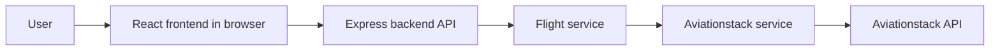
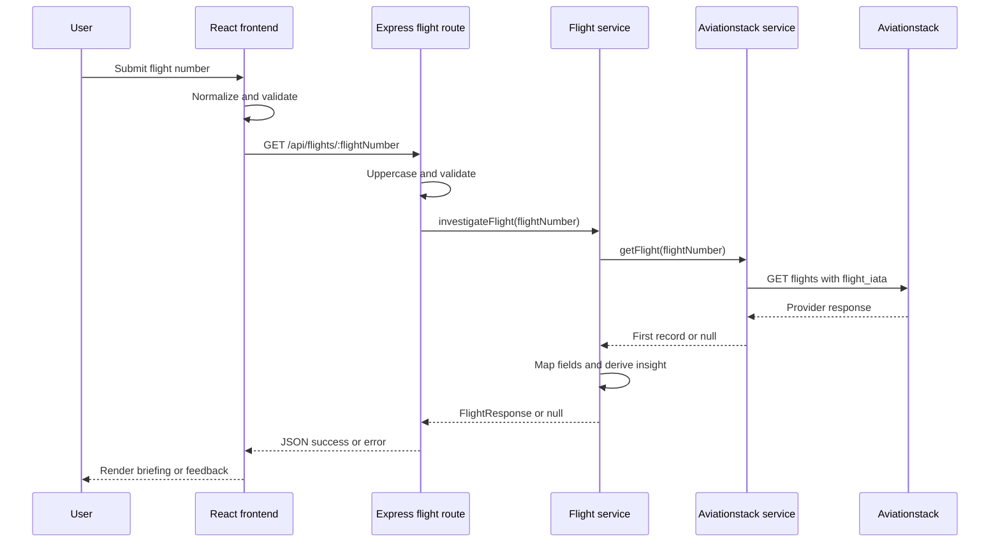

# Flight Detective — High-Level Design

## 1. System boundary

The repository contains two application components:

1. A browser-based React frontend.
2. An Express backend API that calls Aviationstack.

The frontend does not call Aviationstack directly. The backend owns the
provider integration and the provider credential.

## 2. Components

### Frontend

The Vite-built React application collects the flight number, maintains
search/loading/result/error state, calls the backend API, and renders the
flight response. The frontend source types describe the application API
response.

### Express application

`backend/src/app.ts` configures CORS and JSON parsing, mounts the flight
router at `/api/flights`, and defines `GET /api/health`.

### Flight route

`backend/src/routes/flightRoutes.ts` validates the flight number, invokes
the flight service, and converts not-found and exceptional outcomes into
HTTP responses.

### Flight service

`backend/src/services/flightService.ts` calls the provider service and
converts provider data to the application-owned `FlightResponse`. It also
derives delay status and summary text.

### Aviationstack service

`backend/src/services/aviationstackService.ts` reads the backend API key,
constructs the Aviationstack request, checks the HTTP response, and returns
the first data record or `null`.

## 3. Request sequence

## 4. API surface

- `GET /api/health`
- `GET /api/flights/:flightNumber`

The flight route accepts flight-number formats matching
`^[A-Z][A-Z0-9]{1,2}\d{1,4}$`.

## 5. Data ownership

- Aviationstack supplies raw flight, airline, route, schedule, delay,
  aircraft, and live-position data.
- Flight Detective owns its response shape, its status names, delay
  categories, delay summary text, and API error codes.
- The frontend consumes the Flight Detective response shape rather than
  provider types.

## 6. Failure behavior

| Failure | Backend result |
| --- | --- |
| Invalid flight number | `400 INVALID_FLIGHT_NUMBER` |
| No provider record | `404 FLIGHT_NOT_FOUND` |
| Provider HTTP error, missing key, or thrown processing error | `500 FLIGHT_DATA_UNAVAILABLE` |

The frontend distinguishes invalid input and not-found responses; other
request failures are presented as unavailable flight data.

## 7. Runtime and configuration

The backend listens on `PORT`, defaulting to `3000`, and reads
`AVIATIONSTACK_API_KEY`. The frontend uses `VITE_API_BASE_URL` as the
optional API origin. During development, the Vite server proxies `/api` to
`http://localhost:3000`.

## 8. Deployment architecture

This repository includes a backend Dockerfile but no infrastructure-as-code
or frontend container definition. The application can be deployed using
AWS services such as S3, CloudFront, ECR, ECS, and Secrets Manager. These
deployment resources are managed outside this repository and are not
represented as infrastructure-as-code here.
