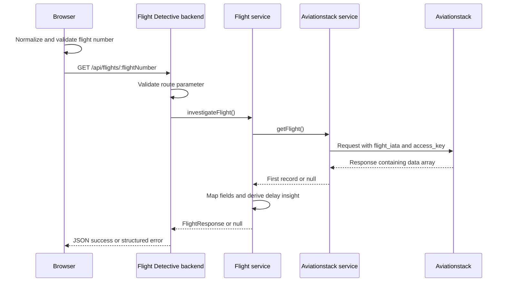

# Flight Detective — System Design

## 1. System shape

The implementation has a static frontend and a request/response backend
API:

```text
Browser UI → Flight Detective API → Aviationstack API
```

The backend is stateless with respect to flight lookups. Each request
queries Aviationstack and returns the transformed result; the repository
contains no database, cache, or background synchronization process.

## 2. Request and trust boundaries

The frontend is responsible for interaction, basic validation, and
rendering. The backend repeats validation and owns the Aviationstack
credential. The provider is accessed through the backend service rather
than directly by browser code.



## 3. Data path

1. The browser submits a flight number from the search form.
2. `App` normalizes and validates the value.
3. `flightApi.getFlight()` performs a `fetch` to
   `/api/flights/:flightNumber`, optionally prefixed by
   `VITE_API_BASE_URL`.
4. The backend route validates again and invokes `investigateFlight()`.
5. The Aviationstack service performs the provider request and extracts the
   first record.
6. The flight service maps provider data into `FlightResponse`.
7. The route responds with the JSON result; the frontend updates its search
   state and renders either the details or feedback.

## 4. Data transformation ownership

The provider-specific model is defined in
`backend/src/types/aviationstack.ts`. The backend-owned API model is defined
in `backend/src/types/flight.ts`; a corresponding frontend type is in
`frontend/src/types/flight.ts`.

The service translates the supported provider status values, handles both
full and compact airline shapes, maps optional aircraft/live objects, and
derives delay insight from departure delay. No provider object is returned
directly to the UI.

## 5. Runtime failures

| Condition | Application behavior |
| --- | --- |
| Invalid flight number | Backend returns `400 INVALID_FLIGHT_NUMBER`; frontend displays invalid-input feedback. |
| Provider result has no first record | Backend returns `404 FLIGHT_NOT_FOUND`; frontend displays not-found feedback. |
| Missing API key, provider HTTP failure, or route exception | Backend returns `500 FLIGHT_DATA_UNAVAILABLE`; frontend displays unavailable feedback. |
| Aircraft or live provider object is `null` | API returns `null` for that optional object; the UI omits its corresponding details. |

Provider non-OK status and response body are logged by the provider
service. Route exceptions are logged by the route before its generic `500`
response.

## 6. Configuration and local development

- Backend `PORT` defaults to `3000`.
- Backend requires `AVIATIONSTACK_API_KEY` to make provider requests.
- Frontend `VITE_API_BASE_URL` supplies an optional API origin.
- Vite development configuration proxies `/api` to
  `http://localhost:3000`.

The backend example environment file is `backend/.env.example`. Frontend
Vite variables are included in the frontend build and must not contain
provider credentials.

## 7. Tests as implemented

Vitest covers backend route behavior, service transformation and delay
rules, frontend state behavior, the search form, and API URL construction.
Playwright covers browser lookup success and not-found flows. Playwright
intercepts the API responses in the browser tests.

## 8. Container

The backend Dockerfile compiles the backend in a build stage and runs a
production runtime image on port `3000`. It runs as the unprivileged
`node` user. The API key is supplied as runtime configuration. The
repository does not define frontend containers or Docker Compose.

## 9. Deployment architecture

The application may be hosted using external platform resources, including
AWS S3, CloudFront, ECR, ECS, and Secrets Manager. These deployment
resources are managed outside this repository and are not represented as
infrastructure-as-code here. The repo-level architecture documented above
is the frontend, backend, and Aviationstack integration present in the
source.
